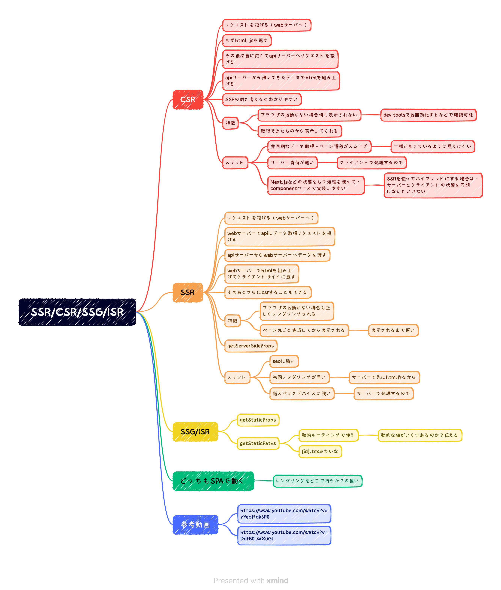
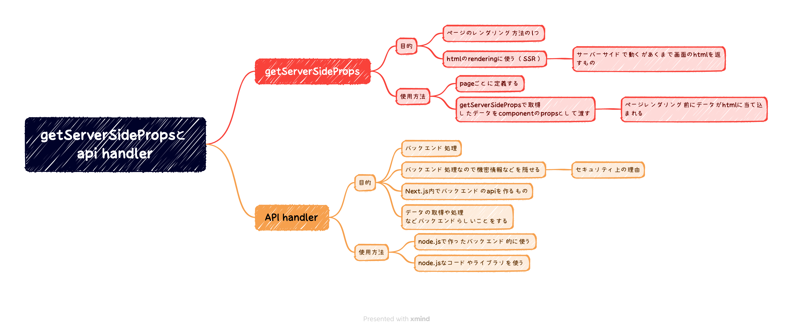

# SSR と CSR について

## 解説

## 参考

- [Server Side Rendering の動作を確認する（Next.js&TypeScript 体験シリーズ）](https://www.youtube.com/watch?v=zYebf1dk6P0)
- [tsuyopon-xyz/learn-ts-with-nextjs CSR、SSR の解説用に作成したコード](https://github.com/tsuyopon-xyz/learn-ts-with-nextjs/pull/1/files)
- [注目のフロントエンドフレームワーク Next.js は何ができるか、ご紹介します！！](https://www.youtube.com/watch?v=DdfB0LWXuGI)

# getServerSideProps と API handler

